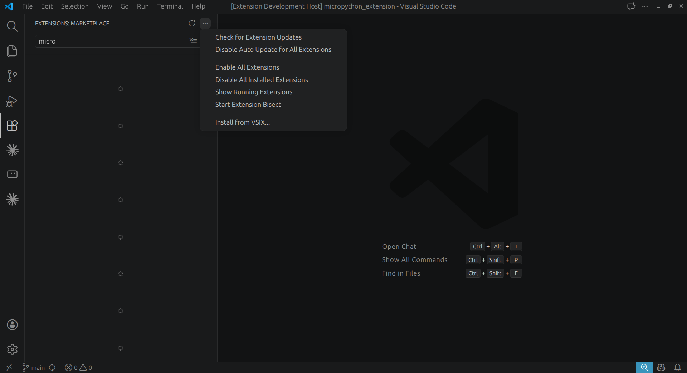
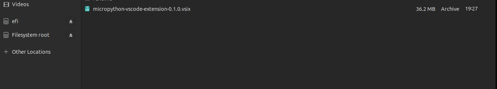
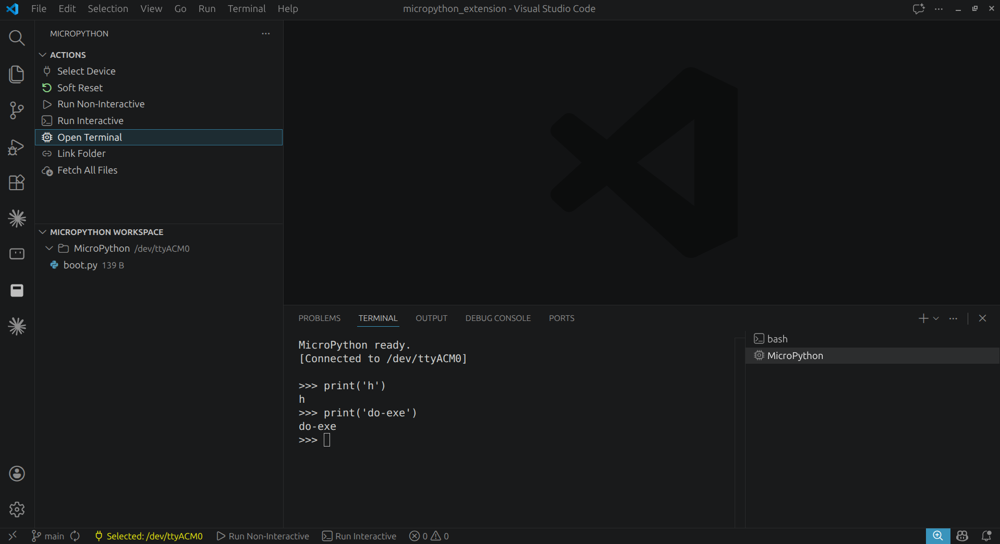
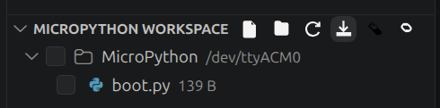

# MicroPython for VS Code

VS Code extension for MicroPython-supported devices.

It gives you two main things:

- REPL access in a VS Code terminal
- Device filesystem control from the sidebar

You can connect to a board, open the REPL, edit files on the device, download files, delete files, fetch everything, link a local folder, and upload a whole folder in bulk.

## Current support

This release currently supports Linux only.

## What you can do

- Select a connected MicroPython device
- Open a MicroPython terminal and use the REPL
- Soft reset the device
- Run the current file in non-interactive mode
- Run the current file in interactive mode
- Browse the device workspace in the sidebar
- Open and edit files directly from the device
- Create, rename, copy, paste, and delete files or folders
- Download selected files with the download action
- Delete selected files with the delete action
- Fetch all files from the device
- Link a local folder and sync or upload the whole folder

## AI-Assisted Operations

This extension provides parameterized commands that AI assistants can use for offline device interactions without needing source code access. These commands enable programmatic control over the MicroPython device, and they also prompt for missing inputs when launched manually from the command palette.

### Available AI Commands

- `micropython.ai.runCode(code: string)`: Execute arbitrary MicroPython code on the device.
- `micropython.ai.uploadFile(localPath: string, remotePath: string)`: Upload a local file to the device.
- `micropython.ai.downloadFile(remotePath: string, localPath: string)`: Download a file from the device.
- `micropython.ai.listFiles(remotePath?: string)`: List files in a device directory (default: "/").
- `micropython.ai.createDir(remotePath: string)`: Create a directory on the device.
- `micropython.ai.delete(remotePath: string)`: Delete a file or directory on the device.
- `micropython.ai.readFile(remotePath: string)`: Read and return file content from the device.
- `micropython.ai.writeFile(remotePath: string, content: string)`: Write content to a file on the device.
- `micropython.ai.stat(remotePath: string)`: Get file/directory statistics.
- `micropython.ai.sendRepl(command: string)`: Send a command to the REPL.
- `micropython.ai.softReset()`: Perform a soft reset on the device.

**Note**: All commands require a device to be selected first. AI assistants can invoke these using VS Code's command system with positional arguments or a single object argument such as `{ "remotePath": "/boot.py" }`.

## Install from VSIX

1. Open VS Code.
2. Go to the Extensions view.
3. Click the `...` menu in the top-right of the Extensions panel.
4. Choose `Install from VSIX...`.
5. Select your VSIX file, for example `micropython-vscode-extension-0.1.0.vsix`.
6. Install the extension shown as `MicroPython`.



Open the Extensions menu, then choose `Install from VSIX...`.



Select the VSIX package file and continue with the installation.

After install, you will see a `MicroPython` view in the Activity Bar.

## First use

1. Connect your MicroPython device over USB.
2. Open the `MicroPython` sidebar.
3. Click `Select Device`.
4. Click `Open Terminal` to open the REPL.
5. Use the `MicroPython Workspace` view to work with files on the device.

When the terminal opens, you can type commands directly and see the board response in VS Code.



## Workspace actions

The `MicroPython Workspace` view is for device files and folders.

- Click a file to open and edit it
- Use refresh to reload the device file tree
- Use the download action to select files and download them
- Use the delete action to select files and remove them
- Use `Link Folder` when you want to sync a local folder to the device in bulk

This is useful when you want to push a project folder instead of uploading files one by one.



The download icon starts file selection for download. The delete icon starts file selection for removal.

## Requirements

- VS Code 1.85.0 or newer
- A MicroPython-compatible device
- USB or serial permission on Linux

## Notes

- This extension is focused on simple MicroPython workflow inside VS Code
- Cross-platform runtime support is not included yet

## Build from source

If you are working on this repository:

```bash
npm install
npm run build
```
