# MicroPython Extension

## What is this?

MicroPython Extension is a VS Code extension for working with MicroPython boards from one place.

It helps you select a serial device, open a REPL terminal, run files, reset the board, sync a local project folder, browse files on the device, and expose the same backend to AI and MCP workflows.

## Who is it for?

It is for makers, students, and embedded developers who build MicroPython projects inside VS Code and want the board workflow to stay close to their editor.

It is also for AI-assisted hardware workflows where the assistant needs structured tools instead of guessing raw serial commands.

## What can it do?

- Select and remember the active MicroPython serial device.
- Open a persistent MicroPython REPL terminal.
- Run the active Python file in non-interactive or interactive mode.
- Soft reset the selected board.
- Browse, edit, create, rename, copy, paste, delete, upload, and download files on the device.
- Mount the device filesystem through the `micropython` VS Code filesystem provider.
- Link a local folder and sync project changes to the device.
- Use bundled VS Code Language Model tools and the MCP adapter for AI-assisted workflows.
- Use Driver xAI catalog tools to discover hardware modules, generate mini MicroPython bundles, deploy them, and execute module commands.

## Install from VSIX

1. Open VS Code.
2. Go to the Extensions view.
3. Click the `...` menu in the top-right of the Extensions panel.
4. Choose `Install from VSIX...`.
5. Select the generated `.vsix` file, for example `micropython-vscode-extension-0.5.0.vsix`.
6. Install the extension shown as `MicroPython Extension`.

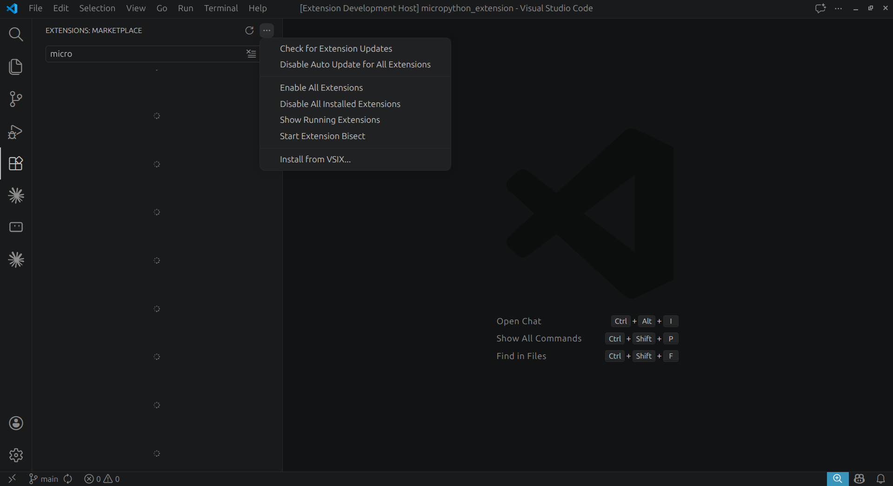

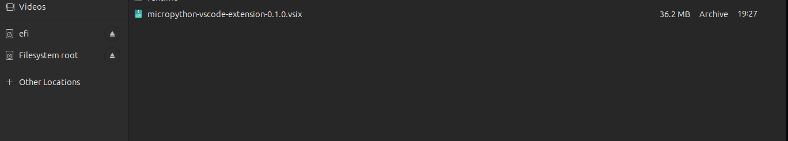

After install, VS Code shows a `MicroPython` view in the Activity Bar.

## First Use

1. Connect your MicroPython board over USB.
2. Open the `MicroPython` sidebar.
3. Run `MicroPython: Select Device`.
4. Open the terminal, run a file, or manage the board workspace from the sidebar.

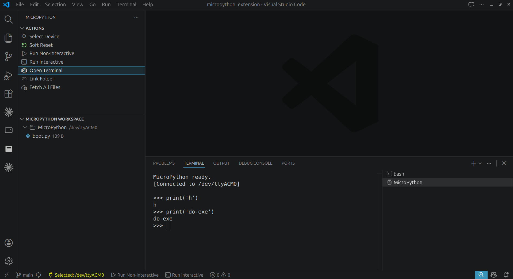

## Actions

### 1. Select Device

Choose the connected MicroPython board or serial port. Select a device first so reset, run, terminal, upload, sync, and workspace actions know which board to use.

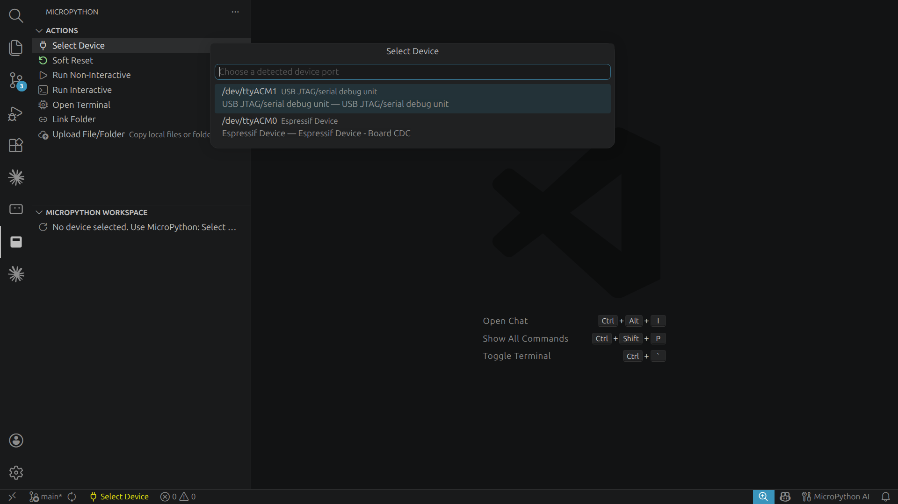

After selecting a device, the extension remembers it as the active target for later actions.

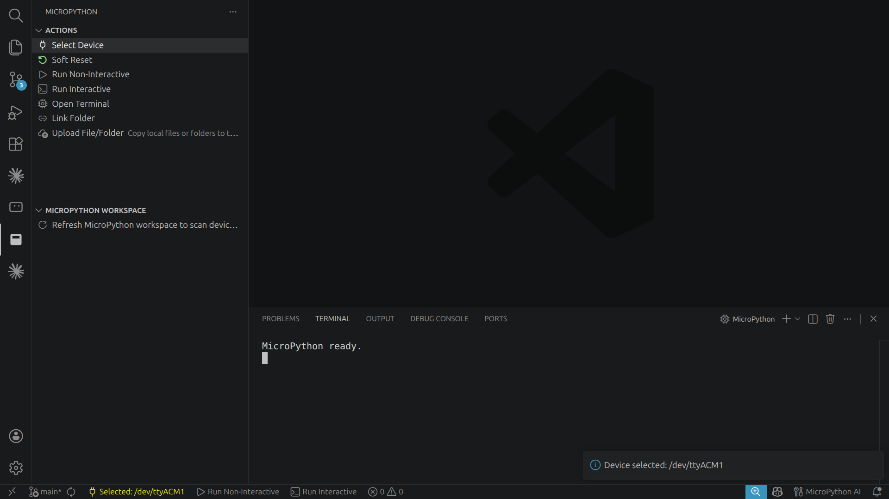

### 2. Open Terminal

Open a MicroPython REPL terminal inside VS Code for direct commands and board output.

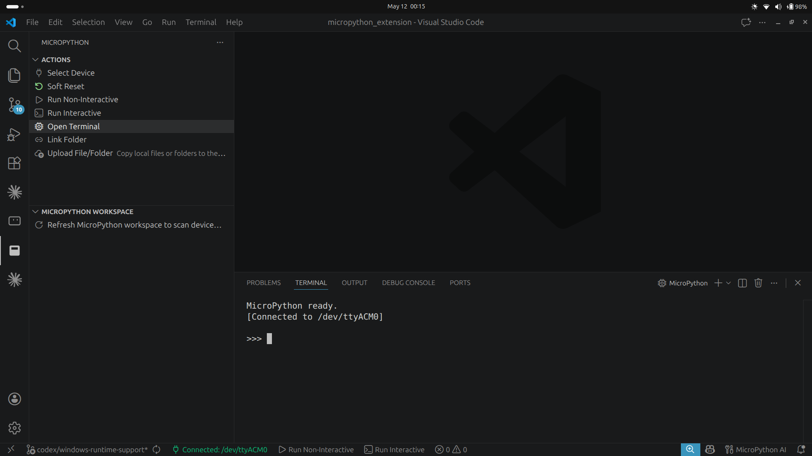

### 3. Soft Reset

Restart the MicroPython runtime on the selected board without unplugging it. This is useful when a script is stuck, when the REPL needs a clean state, or before running another file.

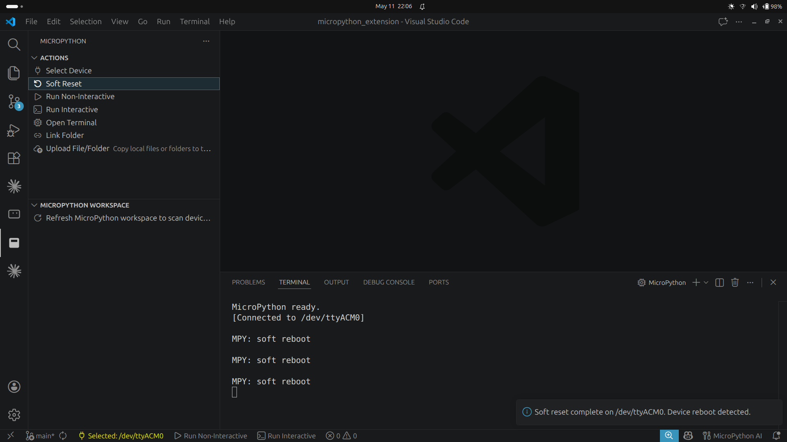

### 4. Run Non-Interactive

Run the active file on the selected device and show the output without keeping an interactive session open.

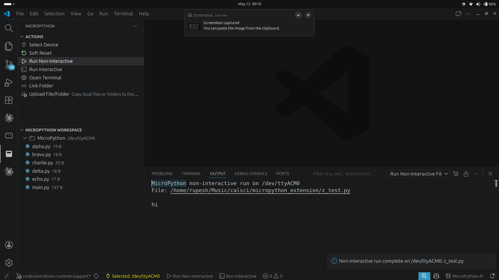

### 5. Run Interactive

Run the active file and keep the terminal attached so you can continue interacting with the board.

### 6. Link Folder And Sync

Choose a local project folder to use for device sync and upload workflows.

After the folder is linked, creating or editing files inside that folder can upload the changes to the device.

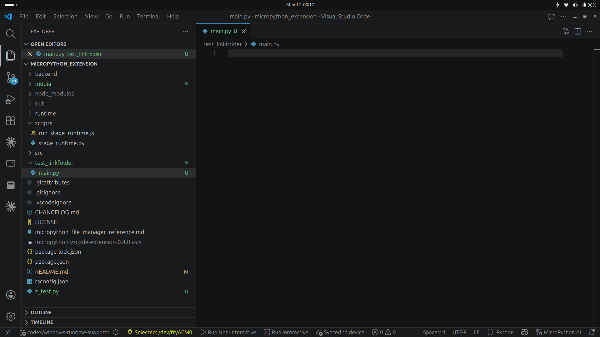

The MicroPython Workspace view can then show the uploaded file on the selected device.

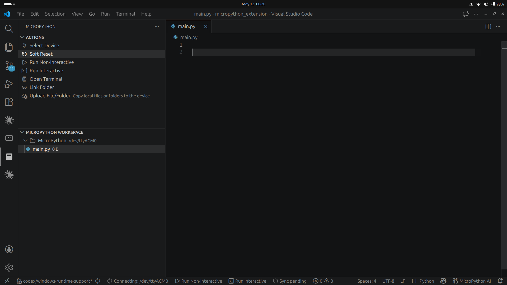

### 7. MicroPython Workspace

The MicroPython Workspace view lets you browse and manage files directly on the selected device.

- `New File`: Create a file on the device.
- `New Folder`: Create a folder on the device.
- `Refresh Workspace`: Reload the device file tree.
- `Download Selected Files`: Download selected device files to your local workspace.
- `Delete Selected Files`: Remove selected files or folders from the device.
- `Mount Workspace in Explorer`: Open the device workspace through the VS Code Explorer.

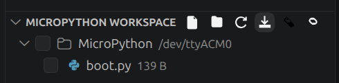

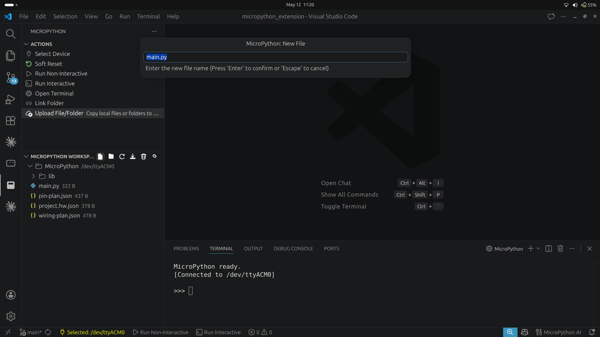

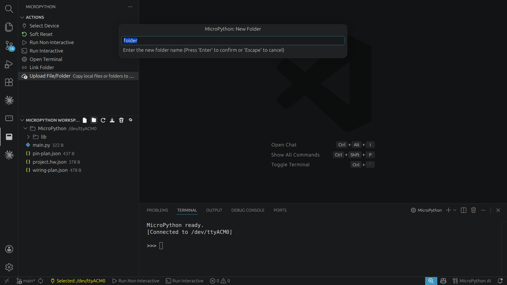

## AI-Assisted Operations

The extension exposes native VS Code Language Model tools and a bundled MCP stdio server. AI agents should use these tools instead of guessing external commands like `mpremote`, `ampy`, `esptool`, or raw serial access.

Core MicroPython tools:

- `micropython_device_status`: Check selected and detected MicroPython devices.
- `micropython_sync_project`: Upload a local project folder through the extension backend.
- `micropython_run_and_test`: Sync, run, capture output, and return structured errors.
- `micropython_filesystem`: List, read, write, create, rename, delete, and stat device files.
- `micropython_soft_reset`: Soft reset the selected MicroPython device.

Driver xAI tools:

- `driver_xai_validate`: Validate the Driver xAI catalog structure.
- `driver_xai_search`: Search modules by module id or module name.
- `driver_xai_registry`: Read protocol or interface registries.
- `driver_xai_info`: Read module identity from `info.json`.
- `driver_xai_inspect`: List module files, drivers, examples, keys, and commands.
- `driver_xai_get`: Read module JSON data or driver source.
- `driver_xai_prepare_bundle`: Generate a mini MicroPython project from selected modules.
- `driver_xai_deploy_bundle`: Upload a generated bundle to a MicroPython device.
- `driver_xai_execute`: Build, deploy, and run a module command through the extension backend.

## Repository Layout

- `src/backend/host/extension`: VS Code TypeScript host backend.
- `src/backend/host/python_service`: Local Python service, serial backend, MCP server, and Driver xAI adapter.
- `src/backend/device`: MicroPython snippets sent to the device.
- `vendor/driver_xAI`: Vendored Driver xAI catalog submodule.
- `runtime`: Packaged Python runtime used by the extension.

See [Architecture](docs/ARCHITECTURE.md) for the detailed backend split.

## Requirements

- VS Code 1.109.0 or newer.
- A MicroPython-compatible board.
- USB or serial access to the board.
- A packaged runtime for your platform. This repository currently includes `linux-x64` and `win32-x64` runtime folders.

## Development

```bash
npm install
npm run compile -- --pretty false
python3 -m pytest tests/python -q
npm run py:compile
```

For setup details, contribution rules, and support information, read:

- [Development Guide](docs/DEVELOPMENT.md)
- [Architecture](docs/ARCHITECTURE.md)
- [Contributing](CONTRIBUTING.md)
- [Support](SUPPORT.md)

## Packaging

```bash
npm run package:vsix
```

Packaging stages the bundled runtime, compiles TypeScript, and creates a `.vsix` package.
